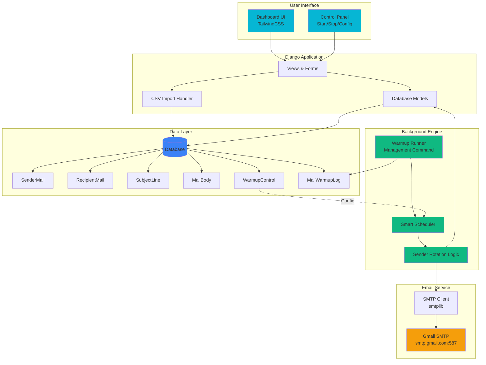

# 📧 Django Email Warmup Engine

<div align="center">


**A self-hosted, intelligent email warmup system designed to improve sender reputation through simulated human-like email behavior.**

[Features](#-features) • [How It Works](#-how-it-works) • [Installation](#-installation) • [Configuration](#-configuration) • [Usage](#-usage)

</div>

---

## 🎯 Overview

Django Email Warmup Engine is a sophisticated mailbox warmup tool that helps establish and maintain strong sender reputation for Gmail accounts. Unlike bulk email senders, this system intelligently simulates natural human email patterns to gradually build trust with email service providers.

### Why Email Warmup?

New or dormant email accounts often face deliverability issues. This tool:
- ✅ Gradually increases sending volume
- ✅ Simulates realistic email patterns
- ✅ Prevents spam folder placement
- ✅ Builds sender reputation organically
- ✅ Supports multiple Gmail accounts simultaneously

---

## ✨ Features

### Core Capabilities

- 🔄 **Multi-Account Management** - Manage multiple Gmail sender accounts with individual daily limits
- 📬 **Recipient Pool** - Maintain a database of recipient emails for realistic warmup cycles
- 📝 **Dynamic Content** - Randomized subject lines and HTML email templates
- 📊 **Smart Scheduling** - Configurable time gaps between emails with intelligent rate limiting
- 📈 **Daily Limits** - Per-sender daily email limits with automatic enforcement
- 📋 **Activity Logging** - Comprehensive tracking of all warmup activities
- 💾 **CSV Bulk Import** - Easy data import for senders, recipients, subjects, and templates
- 🎛️ **Control Dashboard** - TailwindCSS-powered UI for warmup management
- 🤖 **Background Engine** - Automated warmup runner with intelligent sender rotation
- ⚡ **Auto-Resume** - Automatically resumes when limits increase or new senders are added

### Intelligent Logic

The engine includes built-in intelligence to:
- Check sender daily limits before each email
- Skip senders who have reached their quota
- Auto-stop when all senders hit daily limits
- Resume automatically when conditions change
- Randomize all email components for natural appearance

---

## 🏗️ Architecture



### System Flow

1. **Configuration**: Set time gaps and daily limits via control panel
2. **Data Management**: Add senders, recipients, subjects, and bodies (manual or CSV)
3. **Engine Start**: Background runner begins warmup cycle
4. **Smart Selection**: 
   - Check each sender's daily quota
   - Select available sender randomly
   - Pick random recipient, subject, and body
5. **Email Dispatch**: Send HTML email via Gmail SMTP
6. **Logging**: Record activity in warmup logs
7. **Wait**: Sleep for configured time gap
8. **Repeat**: Continue until all senders hit daily limits
9. **Auto-Management**: Resume when limits change or new senders added

---

## 📋 Database Models

| Model | Fields | Purpose |
|-------|--------|---------|
| **SenderMail** | email, app_password, status | Gmail accounts for sending |
| **RecipientMail** | email, status | Recipient pool |
| **SubjectLine** | subject, status | Subject line variations |
| **MailBody** | body (HTML), status | Email template library |
| **WarmupControl** | time_gap_seconds, daily_limit_per_sender, is_running | Engine configuration |
| **MailWarmupLog** | sender, recipient, subject, body, sent_at, status | Activity tracking |

---

## 🚀 Installation

### Prerequisites

- Python 3.12 or higher
- pip package manager
- Gmail account(s) with 2FA enabled

### Setup Steps

1. **Clone the repository**
   ```bash
   git clone https://github.com/amanpandit7033/django-email-warmup.git
   cd django-email-warmup
   ```

2. **Create virtual environment**
   ```bash
   python -m venv venv
   source venv/bin/activate  # On Windows: venv\Scripts\activate
   ```

3. **Install dependencies**
   ```bash
   pip install django
   ```

4. **Run migrations**
   ```bash
   python manage.py migrate
   ```

5. **Create superuser**
   ```bash
   python manage.py createsuperuser
   ```

6. **Collect static files (if needed)**
   ```bash
   python manage.py collectstatic
   ```

---

## ⚙️ Configuration

### Gmail Setup

Before using the warmup engine, configure your Gmail account(s):

1. **Enable 2-Factor Authentication**
   - Go to [Google Account Security](https://myaccount.google.com/security)
   - Enable 2-Step Verification

2. **Generate App Password**
   - Visit [App Passwords](https://myaccount.google.com/apppasswords)
   - Select "Mail" and your device
   - Copy the 16-character password

3. **Unlock CAPTCHA** (One-time)
   - Visit: https://accounts.google.com/DisplayUnlockCaptcha
   - Click "Continue" while logged into your Gmail account

4. **Add to Database**
   - Use the dashboard UI or CSV import
   - Format: `email,app_password,active`

### CSV Import Formats

#### Senders CSV
```csv
email,app_password,status
sender1@gmail.com,abcd efgh ijkl mnop,active
sender2@gmail.com,wxyz 1234 5678 90ab,active
```

#### Recipients CSV
```csv
email,status
recipient1@example.com,active
recipient2@example.com,active
```

#### Subject Lines CSV
```csv
subject,status
Quick Question,active
Following Up,active
Thoughts on This?,active
```

#### Email Bodies CSV
```csv
body,status
"<p>Hi there!</p><p>Hope you're doing well.</p>",active
"<p>Just checking in.</p><p>Best regards</p>",active
```

---

## 🎮 Usage

### Starting the Application

#### Development Mode (Recommended)

Run both Django server and warmup engine together:

```bash
python manage.py dev
```

This custom command starts:
- Django development server (port 8000)
- Background warmup runner

#### Production Mode

Run components separately:

**Terminal 1** - Django Server:
```bash
python manage.py runserver
```

**Terminal 2** - Warmup Engine:
```bash
python manage.py warmup_runner
```

### Dashboard Operations

1. **Access Dashboard**
   - Navigate to `http://localhost:8000`
   - Log in with superuser credentials

2. **Configure Warmup Settings**
   - Set time gap between emails (seconds)
   - Set daily limit per sender
   - Click "Save Configuration"

3. **Add Data**
   - Navigate to Senders/Recipients/Subjects/Bodies sections
   - Add entries manually or use CSV bulk import

4. **Start Warmup**
   - Go to Control Panel
   - Click "Start Warmup"
   - Monitor logs in real-time

5. **Stop Warmup**
   - Click "Stop Warmup" to pause engine
   - Resume anytime by clicking "Start Warmup"

### Monitoring

- **Warmup Logs**: View all sent emails with timestamps and status
- **Auto-Stop**: Engine automatically stops when all senders hit daily limits
- **Auto-Resume**: Engine resumes when limits increase or new active senders are added

---

## 📊 Best Practices

### Warmup Strategy

| Week | Daily Emails/Sender | Time Gap | Notes |
|------|---------------------|----------|-------|
| 1 | 5-10 | 60-120 min | Start slow |
| 2 | 15-25 | 45-90 min | Gradual increase |
| 3 | 30-50 | 30-60 min | Build momentum |
| 4+ | 50-100 | 20-45 min | Maintain reputation |

### Recommendations

- ✅ Use diverse subject lines (minimum 20)
- ✅ Create varied HTML templates (minimum 10)
- ✅ Mix recipient domains (avoid single domain)
- ✅ Gradually increase daily limits week-over-week
- ✅ Monitor Gmail account health regularly
- ✅ Keep sender/recipient ratio balanced
- ⚠️ Never exceed 100 emails/day per sender initially
- ⚠️ Avoid identical subject lines repeatedly

---

## 🛠️ Technical Details

### Management Commands

| Command | Description |
|---------|-------------|
| `python manage.py dev` | Run server + warmup engine together |
| `python manage.py warmup_runner` | Run warmup engine only |
| `python manage.py runserver` | Run Django server only |

### Technology Stack

- **Backend**: Django 6.0 (Python 3.12)
- **Frontend**: TailwindCSS
- **Email**: smtplib, email.mime
- **Database**: SQLite (default) / PostgreSQL / MySQL compatible
- **No external dependencies** except Django

### Key Libraries

```python
import smtplib
import email.mime
import csv
import random
import time
```

---

## 🔒 Security Notes

- Never commit app passwords to version control
- Use environment variables for sensitive data in production
- Regularly rotate Gmail app passwords
- Monitor for suspicious activity in Gmail security settings
- Keep Python and Django updated

---

## 🤝 Contributing

Contributions are welcome! Please feel free to submit a Pull Request.

1. Fork the repository
2. Create your feature branch (`git checkout -b feature/AmazingFeature`)
3. Commit your changes (`git commit -m 'Add some AmazingFeature'`)
4. Push to the branch (`git push origin feature/AmazingFeature`)
5. Open a Pull Request

---

## 📝 License

This project is licensed under the MIT License - see the [LICENSE](LICENSE) file for details.

---

## ⚠️ Disclaimer

This tool is designed for legitimate email warmup purposes only. Users are responsible for:
- Complying with Gmail's Terms of Service
- Following email marketing laws (CAN-SPAM, GDPR, etc.)
- Obtaining proper consent from recipients
- Using the tool ethically and legally

**This is NOT a bulk email sender or spam tool.**

---

## 💡 Roadmap

- [ ] IMAP integration for auto-reply handling
- [ ] Advanced analytics dashboard
- [ ] Email reputation score tracking
- [ ] Multi-provider support (Outlook, Yahoo)
- [ ] API for programmatic control
- [ ] Docker containerization
- [ ] Advanced scheduling algorithms
- [ ] Email validation and verification

---

## 📧 Support

For issues, questions, or contributions:

- **Issues**: [GitHub Issues](https://github.com/amanpandit7033/django-email-warmup/issues)
- **Discussions**: [GitHub Discussions](https://github.com/amanpandit7033/django-email-warmup/discussions)

---

<div align="center">

**Built with ❤️ using Django**

⭐ Star this repo if you find it useful!

</div>